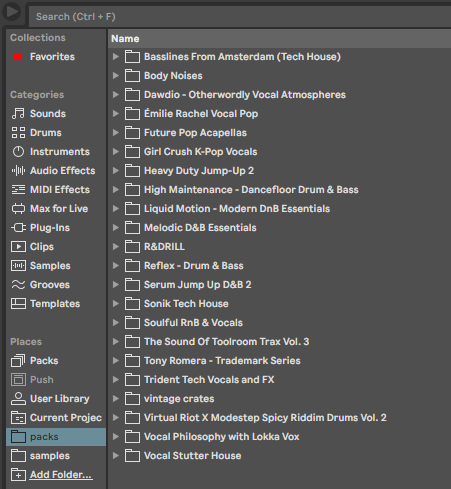
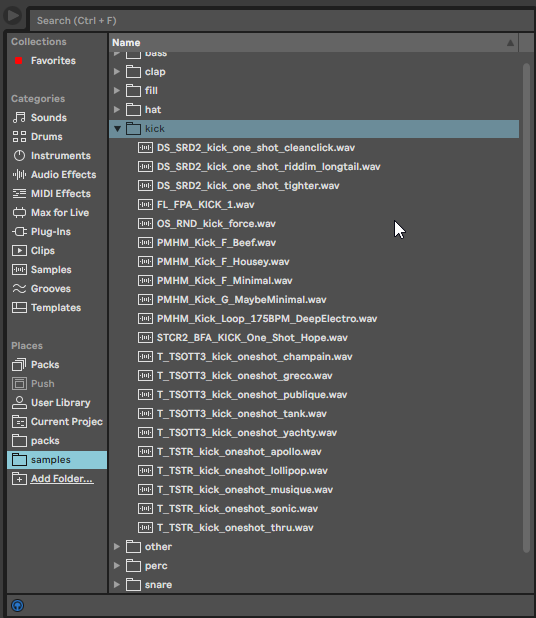

# Unspliced

Sick and tired of having 5000 unsorted samples in your sound library?

This tool will attempt to sort them properly according to file name, which should do the trick for MOST samples coming from Splice.

**Before Unspliced:**

**After Unspliced:**

# Disclaimer

Very much WIP, don't break your projects with this :-) Contributions, PR's, Issues are welcome.

Please don't use this tool if you do not  more or less understand what the code is doing.

Developed and tested on Windows. Hide yo Macs (or create Issues / PR's)

Currently only copies files non-destructively rather than removing them.

# License 

MIT

# Todo's

* Hats -> Differentiate between open and closed
* Vocals / Songstarters / ... -> Add check for the Key and BPM of the sample
* Autoclean (move + delete old folders)
* Cleanup (or move?) ableton analysis files in src directory
* Implement `click` for better toolability.
* Differentiate between `one_shot`s and `loop`s